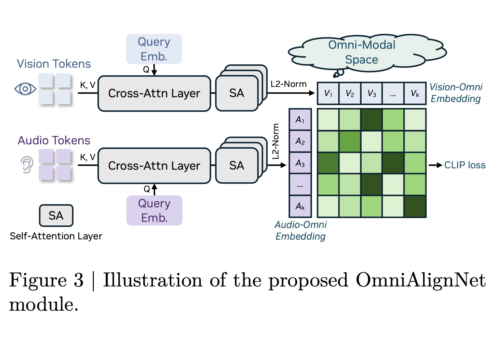

# OmniAlignNet Implementation



An open-source PyTorch implementation of OmniAlignNet from the OmniVinci paper, designed to align vision and audio embeddings in a shared omni-modal space.

## Paper Reference

**OmniVinci: Enhancing Architecture and Data for Omni-Modal Understanding LLM**
- Authors: Hanrong Ye, Chao-Han Huck Yang, Arushi Goel, Wei Huang, Ligeng Zhu, Yuanhang Su, Sean Lin, An-Chieh Cheng, Zhen Wan, Jinchuan Tian, Yuming Lou, Dong Yang, Zhijian Liu, Yukang Chen, Ambrish Dantrey, Ehsan Jahangiri, Sreyan Ghosh, Daguang Xu, Ehsan Hosseini-Asl, Danial Mohseni Taheri, Vidya Murali, Sifei Liu +10 authors
- Published: October 17, 2024
- Paper: [arXiv:2510.15870](https://arxiv.org/abs/2510.15870)

## Key Features

This implementation includes:

- **OmniAlignNet Architecture**: Dual-stream multimodal alignment with cross-attention and self-attention layers
- **Cross-Modal Alignment**: CLIP-style contrastive loss for vision-audio alignment
- **Optimized Implementation**: Vectorized operations and parallel processing for efficiency
- **Custom Attention Mechanisms**: Self-attention and cross-attention layers implemented from scratch

## Architecture Components

### OmniNet Module
The main module that processes vision and audio tokens through:
- Cross-attention layers for modality interaction
- Self-attention layers for intra-modal processing
- L2 normalization for embedding alignment
- CLIP-style contrastive loss computation

### Attention Mechanisms
- **CrossAttention**: Custom implementation for cross-modal attention
- **SelfAttention**: Custom implementation for self-attention within modalities

## Documentation

For complete API reference including all methods, input/output types, and detailed usage examples, see the **[API Reference Documentation](API_REFERENCE.md)**.

## Install

```bash
pip3 install -U torch
```

## Usage

```python
import torch
from main import OmniNet

# Initialize the model
model = OmniNet(
    dim=512,
    num_heads=8,
    query_heads=4,
    dropout=0.1,
    kv_heads=2,
    temperature=0.07,
)

# Create sample input data
batch_size = 2
vision_seq_len = 10
audio_seq_len = 8
dim = 512

vision_tokens = torch.randn(batch_size, vision_seq_len, dim)
audio_tokens = torch.randn(batch_size, audio_seq_len, dim)

# Forward pass
with torch.no_grad():
    vision_embeddings, audio_embeddings, clip_loss = model(
        vision_tokens, audio_tokens
    )
    
    print(f"Vision embeddings: {vision_embeddings.shape}")
    print(f"Audio embeddings: {audio_embeddings.shape}")
    print(f"CLIP loss: {clip_loss.item():.4f}")
```

## Implementation Details

- **Parallel Processing**: Optimized forward pass with parallel stream processing
- **Vectorized Operations**: CLIP loss computation using batch matrix operations
- **Memory Efficiency**: In-place operations and optimized memory usage
- **JIT Compilation**: Optional JIT compilation for performance optimization

## Requirements

- PyTorch
- Python 3.7+

## Citation

If you use this implementation in your research or projects, please cite:

```bibtex
@software{gomez2024omnialignnet,
  author = {Gomez, Kye},
  title = {OmniAlignNet: PyTorch Implementation},
  year = {2025},
  url = {https://github.com/kyegomez/OmniAlignNet},
  email = {kye@swarms.world}
}
```

For the original OmniVinci paper, please cite:

```bibtex
@article{ye2024omnivinci,
  title={OmniVinci: Enhancing Architecture and Data for Omni-Modal Understanding LLM},
  author={Ye, Hanrong and Yang, Chao-Han Huck and Goel, Arushi and others},
  journal={arXiv preprint arXiv:2510.15870},
  year={2025}
}
```

## License

This implementation is provided as an educational resource and follows the same open-source principles as the original OmniVinci paper.

## Note

This is a simplified implementation focusing on the core OmniAlignNet architecture. For full functionality including temporal embedding grouping and constrained rotary time embedding, refer to the original paper and official implementation.
